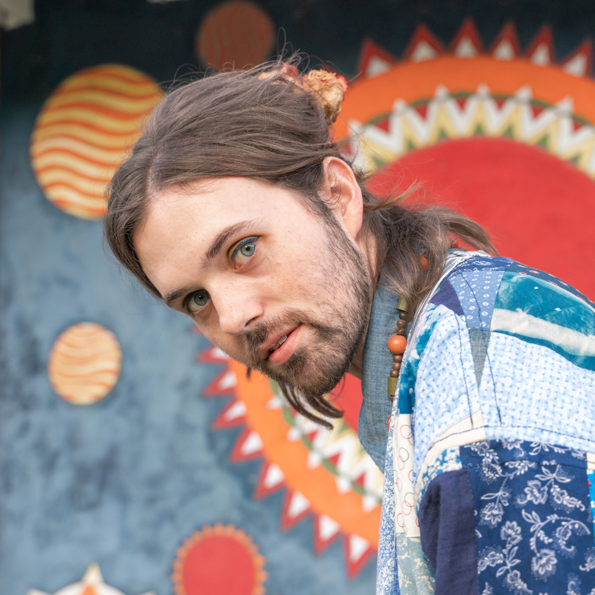

 

  

Dalton Newbend is an artist from [Dexter, GA](https://en.wikipedia.org/wiki/Dexter,_Georgia). They received their [BFA](https://en.wikipedia.org/wiki/Bachelor_of_Fine_Arts) in Studio Art and minor in Art History from [Columbus State University](https://columbusstate.edu/art/) in 2020. They were also a 2019 fellow at [Mildred’s Lane](https://mildredslane.org/).

[daltonnewbend@proton.me](mailto:daltonnewbend@proton.me)
[instagram@daltonnewbend.art](https://www.instagram.com/daltonnewbend.art/)
